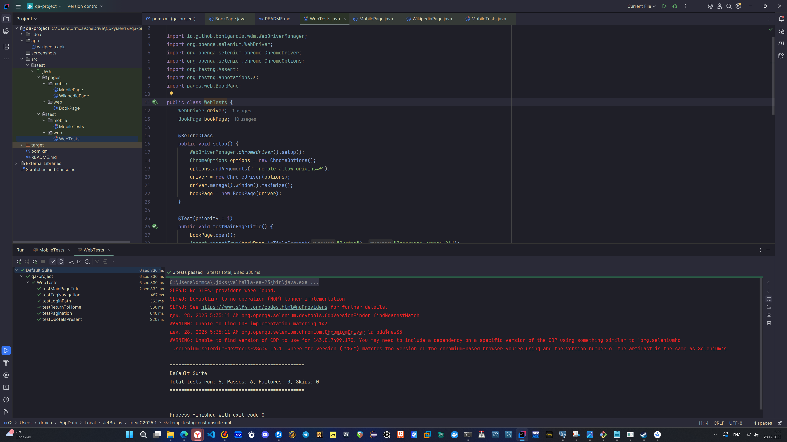
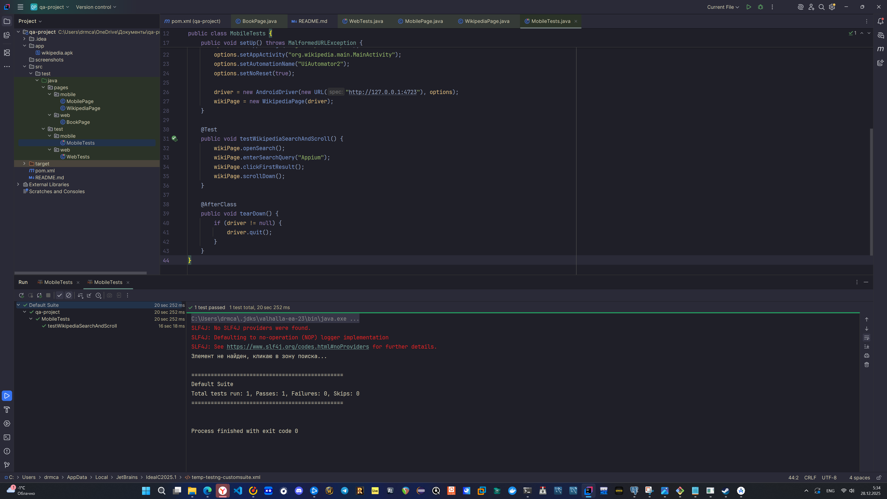

# 🚀 Automation Framework
## Web (Quotes to Scrape) & Mobile (Wikipedia Android)

Базовый фреймворк для автоматизации тестирования Web и Mobile приложений.  
Архитектура построена на паттерне Page Object Model (POM).

---

## 💻 Web: Quotes to Scrape

https://quotes.toscrape.com/

### Классы
- pages.web.BookPage
- test.web.WebTests

### Тесты
- testMainPageTitle  
  Проверка заголовка страницы на наличие текста Quotes

- testTagNavigation  
  Переход по тегу love и проверка URL

- testLoginPath  
  Переход на страницу логина

- testReturnToHome  
  Возврат на главную страницу через заголовок сайта

- testPagination  
  Переход на страницу /page/2/ через кнопку Next

- testQuoteIsPresent  
  Проверка наличия хотя бы одной цитаты на странице

---

## 📱 Mobile: Wikipedia (Android)

Приложение: Wikipedia Alpha

### Классы
- pages.mobile.WikipediaPage
- test.mobile.MobileTests

### Сценарий
1. Запуск приложения
2. Пропуск onboarding-экранов
3. Открытие поиска
4. Поиск по запросу Appium
5. Переход по первому результату
6. Скролл страницы вниз

---

## 🛠 Настройка

### Android SDK
Создать переменную среды:  
ANDROID_HOME=C:\Users\ИМЯ\AppData\Local\Android\Sdk

Добавить в Path:  
%ANDROID_HOME%\platform-tools

---

### Подключение устройства
Подключить телефон по USB  
Выполнить команду:  
adb devices

Указать ID устройства в MobileTests.java:  
options.setDeviceName("ВАШ_ID");

---

### Appium
Запустить сервер:  
appium

---

## 🚀 Запуск тестов

### IntelliJ IDEA
Web: WebTests.java → Run  
Mobile: MobileTests.java → Run

### Maven
mvn test

---

## 📂 Структура проекта

src/test/java/  
├── pages/  
│   ├── web/  
│   └── mobile/  
└── test/  
├── web/  
└── mobile/

---

## 📸 Скриншоты успешного выполнения (Test Results)

| Платформа | Скриншот результата |
| :--- | :--- |
| **Web (Selenium)** |  |
| **Mobile (Appium)** |  |
---

## 🚨 Troubleshooting

Web:
- Обновить Google Chrome

Mobile:
- Убедиться, что Appium запущен
- Проверить USB Debugging  
